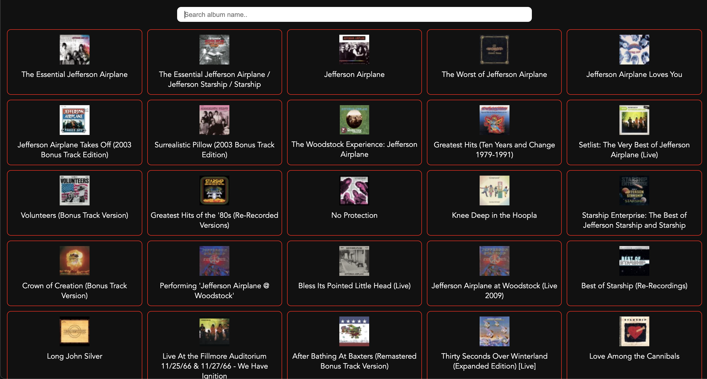
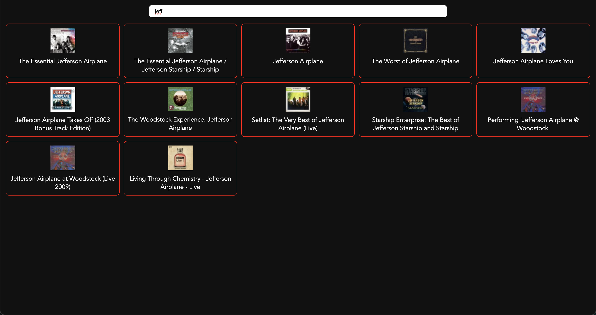
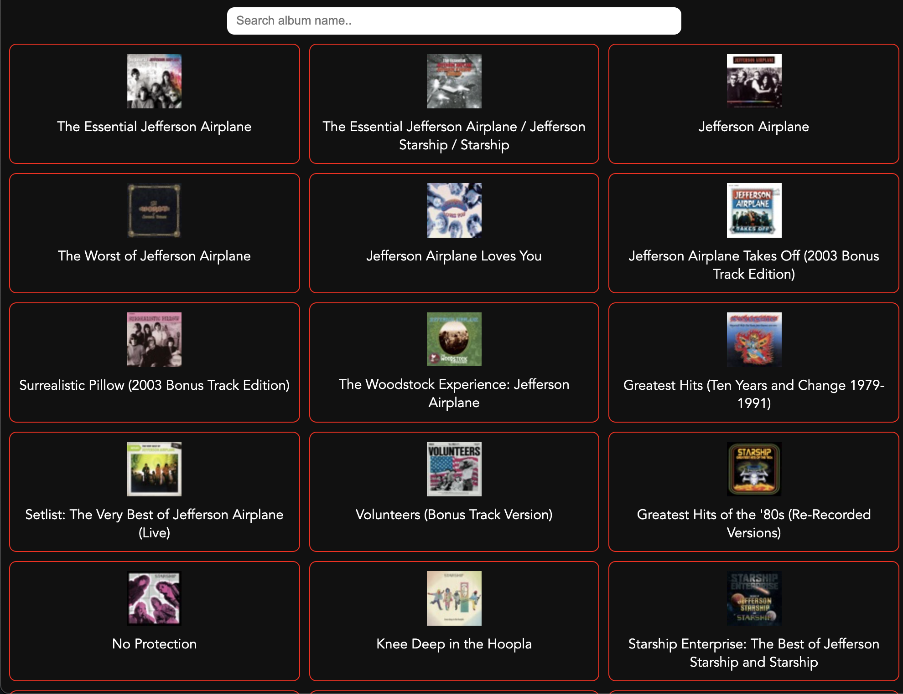
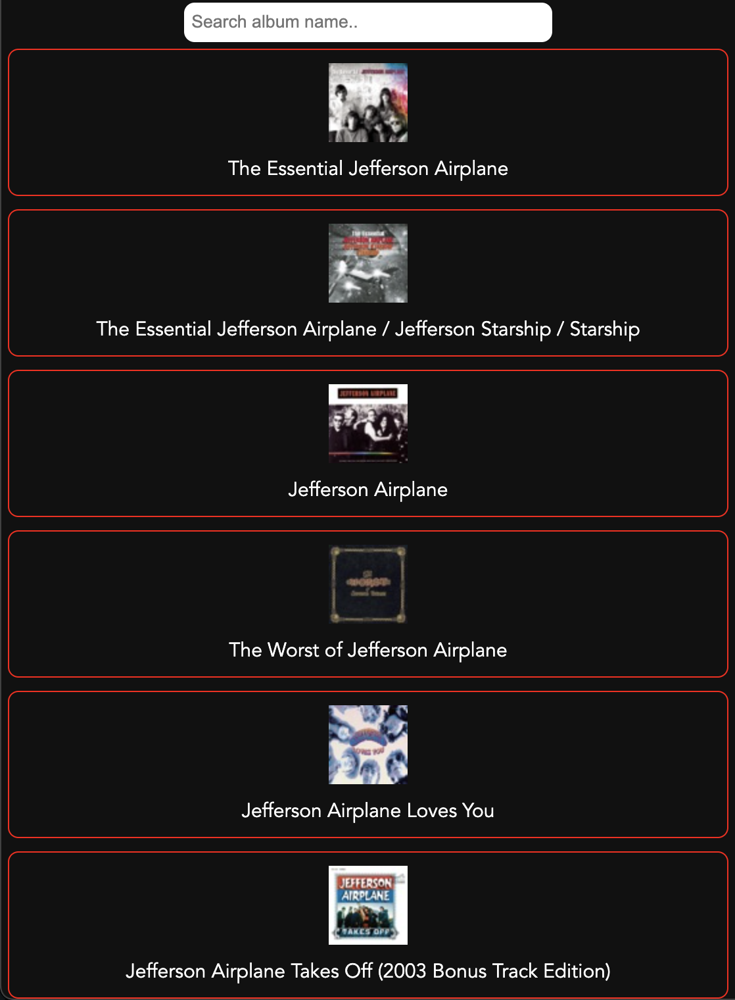

# HP-coding-challange

## Screenshots

### Full size screen

<p align="left">

</p>

### Live search box

<p align="left">

</p>

### Table size screen

<p align="left">

</p>

### Phone size screen

<p align="left">

</p>

## Getting Started

1. Clone repo

```
git clone https://github.com/Jonas-Petrauskas/HP-coding-challange.git
```
2. Install dependencies in the **Cliet** and the **Server**
```
Client -> cd client -> npm install
```
```
Server -> cd server -> npm install
```
3. Start development **Client** and **Server**
```
Client -> npm
```
```
Server -> nodemon
```